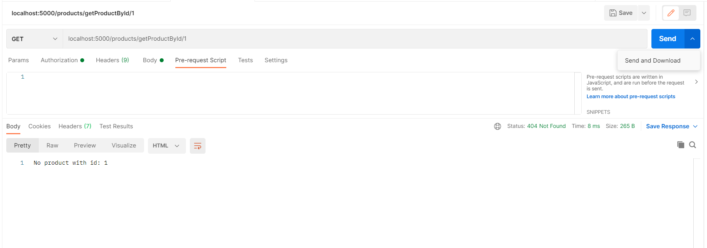

# Medicine Review Application | Backend

---
## Requirements

For development, you will only need Node.js and a node global package, npm, installed in your environement.

## Local setup

    $ git clone https://github.com/shivaprasad-bhat/backend-med-review.git

## Install all packages

    $ npm install

## Running the project on localhost

    $ npm start

## Simple build for production

    $ npm build

## API ENDPOINTS AVAILABLE

## 1. GET products [GET] -> http://localhost:5000/products
&nbsp;&nbsp;

&nbsp;&nbsp;

## 2. User Signup [POST] -> http://localhost:5000/users/signup
&nbsp;&nbsp;

&nbsp;&nbsp;

## 3. User Signin [POST] -> http://localhost:5000/users/signin
&nbsp;&nbsp;

&nbsp;&nbsp;

## 4. Create product [POST] -> http://localhost:5000/products
&nbsp;&nbsp;

&nbsp;&nbsp;

&nbsp;&nbsp;

## 5. Update product [PATCH] -> http://localhost:5000/products/{productId}
- productId should be appended in the url, and the token should be provided (user have to login).

&nbsp;&nbsp;

## 6. Delete product [DELETE] -> http://localhost:5000/products/{productId}
productId should be appended in the url
&nbsp;&nbsp;
&nbsp;&nbsp;

## 7. Create review [PATCH] -> http://localhost:5000/createReview/{productId}
- productId should be appended in the url, and the token should be provided (user have to login).
&nbsp;&nbsp;
&nbsp;&nbsp;

## 8. Update review [PATCH] -> http://localhost:5000/updateReview/{reviewId}&{productId}
- productId and reviewId should be appended in the url, and the token should be provided (user have to login).
&nbsp;&nbsp;
&nbsp;&nbsp;

## 9. Get all users [GET] -> http://localhost:5000/users
- Only admin access allowed.
&nbsp;&nbsp;
&nbsp;&nbsp;

## 10. Get users by id [GET] -> http://localhost:5000/users/{id}
- Only admin access allowed.
&nbsp;&nbsp;

## 11. Get products by id [GET] -> http://localhost:5000/products/getProductById/{productID}

&nbsp;&nbsp;

## 12. Get product by name [GET] -> http://localhost:5000/products/getProductsByName/{productName}

&nbsp;&nbsp;

## 13. Sort products by rating [GET] -> http://localhost:5000/products/sortByRatings

&nbsp;&nbsp;

## 14. Delete Review [PATCH] -> http://localhost:5000/products/deleteReview/{reviewId}&{productId}

&nbsp;&nbsp;

## 15. Filter By Category [GET] -> http://localhost:5000/products/filterByCategory/:category

&nbsp;&nbsp;

## 16. Update user [PATCH/PUT] -> http://localhost:5000/users/{id}
&nbsp;&nbsp;

&nbsp;&nbsp;

## 17. Delete user [DELETE] -> http://localhost:5000/users/{id}
&nbsp;&nbsp;

&nbsp;&nbsp;

## Other Functionality

## 1. Overall Rating
- Calculates overall rating of the products by taking average of the review ratings.
&nbsp;&nbsp;

&nbsp;&nbsp;

